<div align="center">

# Data-Pulse

### Enterprise Document Management Platform


**A document management solution designed for KMRL**  
*Built for Smart India Hackathon (SIH) Project*

[Features](#-features) • [Architecture](#-architecture) • [Quick Start](#-quick-start) • [Documentation](#-documentation)

</div>

---

## Table of Contents

- [Overview](#-overview)
- [Features](#-features)
- [Tech Stack](#-tech-stack)
- [Architecture](#-architecture)
- [Prerequisites](#-prerequisites)
- [Installation & Setup](#-installation--setup)
    - [Using Docker (Recommended)](#1-using-docker-recommended)
    - [Manual Setup](#2-manual-setup)
- [Configuration](#-configuration)
- [Running the Application](#-running-the-application)
- [API Documentation](#-api-documentation)
- [Development](#-development)
- [Testing](#-testing)
- [Code Quality](#-code-quality)
- [Project Structure](#-project-structure)
- [Contributing](#-contributing)
- [License](#-license)

---

## Overview

**Data-Pulse** is an enterprise-grade document management platform built for large organizations to handle internal document workflows efficiently. The system provides intelligent document processing with AI-powered summarization, entity extraction, and automated content classification.

### Key Capabilities

- **Intelligent Document Processing**:  Automated OCR, text extraction, and AI-based summarization
- **Multi-format Support**: PDF, Images, Office documents, and email attachments
- **Enterprise Search**: Full-text search powered by Elasticsearch
- **Scalable Storage**: S3-compatible object storage (MinIO)
- **AI Integration**: OpenAI GPT-4o-mini & Google Gemini for document analysis
- **Real-time Processing**: Asynchronous document workflow management

---

## Features

### Functional Requirements

- **Ingestion & Data Normalization** - Multi-source document intake with standardization
- **Document Summarization** - AI-powered intelligent summarization
- **Entity & Keyword Extraction** - Automated metadata extraction
- **Content Routing & Personalization** - Smart document routing (In Progress)
- **Information Retrieval & Traceability** - Full audit trail (In Progress)
- **Real-time Alerts & Notifications** - Event-driven notifications (Planned)
- **Knowledge Base Management** - Centralized knowledge repository (Planned)
- **Bilingual Support** - Multi-language document processing (Planned)

### Non-Functional Requirements

- **Performance**:  Optimized for high-throughput document processing
- **Scalability**: Horizontally scalable microservices architecture
- **Security**: Enterprise-grade authentication & authorization
- **Reliability**:  Fault-tolerant with automated recovery mechanisms
- **Accuracy**: AI-powered processing with manual verification workflows
- **Usability**: Intuitive RESTful API design
- **Auditability**: Complete compliance tracking

---

## Tech Stack

### Backend Framework

-ED8B00?style=flat-square&logo=openjdk)

### Databases & Search


### Storage & Infrastructure


### AI & ML Services


### Build & Code Quality


---


## Architecture

[](Data-Pulse-Arch-Diagram.svg)

*Click the diagram above to view in full resolution*

---


## Prerequisites

Before you begin, ensure you have the following installed:

| Tool | Version | Purpose |
|------|---------|---------|
| **Java JDK** | 21+ (Eclipse Temurin recommended) | Runtime environment |
| **Maven** | 3.8+ | Build & dependency management |
| **Docker** | 20.10+ | Container orchestration |
| **Docker Compose** | 2.0+ | Multi-container management |
| **Git** | Latest | Version control |

### Optional (for manual setup)
- MongoDB 6.0+
- Elasticsearch 8.15.3
- MinIO Server
- Tesseract OCR

---

## Installation & Setup

### 1. Using Docker (Recommended)

This is the fastest way to get started.  All dependencies are containerized.

#### Step 1: Clone the Repository

```bash
git clone https://github.com/siddhantkore/Data-Pulse.git
cd Data-Pulse
```

#### Step 2: Configure Environment Variables

Create an `application.properties` file:

```bash
# Navigate to resources directory
cd src/main/resources
```

Create `application.properties` with the following content:

```properties
# Server Configuration
server.port=8080
spring.application.name=elastic
spring.servlet.multipart.max-file-size=10MB

# Elasticsearch Configuration
spring.data.elasticsearch.cluster-name=my-doc-application
spring.data.elasticsearch.node-name=node-1
spring.elasticsearch.uris=http://elasticsearch:9200

# MongoDB Configuration
spring.data.mongodb.uri=mongodb://mongo:27017/documentsdb
spring.data.mongodb.host=mongo
spring.data.mongodb.port=27017
spring.data.mongodb.database=documentsdb

# MinIO S3 Configuration
s3.endpoint=http://minio:9000
s3.bucket=my-bucket
s3.access-key=minio
s3.secret-key=minio123
s3.region=us-east-1

# Tesseract OCR
tesseract.datapath=/usr/share/tesseract-ocr/5/tessdata

# OpenAI Configuration
openai.api. key=YOUR_OPENAI_API_KEY
openai.api.url=https://api.openai.com/v1/chat/completions
openai.model=gpt-4o-mini

# Google Gemini Configuration
gemini.api.key=YOUR_GEMINI_API_KEY
gemini.api.url=https://generativelanguage.googleapis.com/v1beta/models/gemini-1.5-flash:generateContent

# Email Configuration (Optional)
spring.mail.host=imap.gmail.com
spring. mail.port=993
spring.mail.username=YOUR_EMAIL
spring.mail.password=YOUR_APP_PASSWORD
spring.mail.properties.mail.imaps.ssl.enable=true
spring.mail.properties.mail.debug=false

# Spring Configuration
spring.main.allow-bean-definition-overriding=true
```

> **Important**: Replace `YOUR_OPENAI_API_KEY`, `YOUR_GEMINI_API_KEY`, and email credentials with your actual values.

#### Step 3: Start All Services

```bash
# Return to project root
cd ../../..

# Build and start all containers
docker-compose up --build
```

This will start:
- **Elastic Service** (Port 8080)
- **MongoDB** (Port 27017)
- **Elasticsearch** (Port 9200)
- **MinIO** (Port 9000 - API, Port 9001 - Console)

#### Step 4: Verify Services

```bash
# Check container status
docker-compose ps

# View logs
docker-compose logs -f elastic
```

#### Step 5: Access Services

| Service | URL | Credentials |
|---------|-----|-------------|
| **API** | http://localhost:8080 | - |
| **MinIO Console** | http://localhost:9001 | User: `minio`<br>Password: `minio123` |
| **Elasticsearch** | http://localhost:9200 | - |
| **MongoDB** | mongodb://localhost:27017 | - |

---

### 2. Manual Setup

For development or custom configurations.

#### Step 1: Install Dependencies

**Ubuntu/Debian:**
```bash
# Install Java 21
sudo apt update
sudo apt install openjdk-21-jdk

# Install Maven
sudo apt install maven

# Install Tesseract OCR
sudo apt install tesseract-ocr tesseract-ocr-eng

# Verify installations
java -version
mvn -version
tesseract --version
```

**macOS:**
```bash
# Using Homebrew
brew install openjdk@21 maven tesseract

# Set Java 21 as default
export PATH="/opt/homebrew/opt/openjdk@21/bin:$PATH"
```

**Windows:**
- Download [Java 21 JDK](https://adoptium.net/)
- Download [Maven](https://maven.apache.org/download.cgi)
- Download [Tesseract](https://github.com/UB-Mannheim/tesseract/wiki)

#### Step 2: Setup External Services

**MongoDB:**
```bash
# Using Docker
docker run -d -p 27017:27017 --name mongo mongo:6.0
```

**Elasticsearch:**
```bash
# Using Docker
docker run -d \
  -p 9200:9200 \
  -e "discovery.type=single-node" \
  -e "xpack.security.enabled=false" \
  --name elasticsearch \
  docker.elastic.co/elasticsearch/elasticsearch:8.15.3
```

**MinIO:**
```bash
# Using Docker
docker run -d \
  -p 9000:9000 -p 9001:9001 \
  -e "MINIO_ROOT_USER=minio" \
  -e "MINIO_ROOT_PASSWORD=minio123" \
  --name minio \
  minio/minio server /data --console-address ": 9001"
```

#### Step 3: Clone & Configure

```bash
git clone https://github.com/siddhantkore/Data-Pulse.git
cd Data-Pulse

# Configure application.properties (see Docker setup for template)
nano src/main/resources/application. properties
```

Update `application.properties` with local endpoints:
```properties
spring.elasticsearch.uris=http://localhost:9200
spring.data. mongodb.uri=mongodb://localhost:27017/documentsdb
s3.endpoint=http://localhost:9000
```

#### Step 4: Build & Run

```bash
# Install dependencies
./mvnw clean install -DskipTests

# Run the application
./mvnw spring-boot:run
```

Or use your IDE:
1. Import project as Maven project
2. Run `ElasticApplication. java`

---

## Configuration

### API Keys Setup

#### OpenAI API Key
1. Visit [OpenAI Platform](https://platform.openai.com/api-keys)
2. Create a new API key
3. Add to `application.properties`:
   ```properties
   openai.api. key=sk-proj-YOUR_KEY_HERE
   ```

#### Google Gemini API Key
1. Visit [Google AI Studio](https://makersuite.google.com/app/apikey)
2. Create API key
3. Add to `application.properties`:
   ```properties
   gemini.api.key=YOUR_GEMINI_KEY_HERE
   ```

### MinIO Bucket Creation

```bash
# Access MinIO Console:  http://localhost:9001
# Login: minio / minio123
# Create bucket named:  my-bucket
```

Or using MinIO Client:
```bash
docker exec -it minio mc mb /data/my-bucket
```

---

## Running the Application

### Development Mode

```bash
# With Maven Wrapper
./mvnw spring-boot:run

# With installed Maven
mvn spring-boot:run
```

### Production Mode

```bash
# Build JAR
./mvnw clean package -DskipTests

# Run JAR
java -jar target/elastic-0.0.1-SNAPSHOT. jar
```

### Docker Production Build

```bash
# Build image
docker build -t data-pulse: latest .

# Run container
docker run -p 8080:8080 \
  -e SPRING_ELASTICSEARCH_URIS=http://elasticsearch:9200 \
  -e SPRING_DATA_MONGODB_URI=mongodb://mongo:27017/documentsdb \
  data-pulse:latest
```

---

## API Documentation

### Health Check

```bash
GET http://localhost:8080/actuator/health
```

### Document Upload

```bash
POST http://localhost:8080/api/documents/upload
Content-Type: multipart/form-data

Body:
- file: [Document file]
- metadata: { "department": "HR", "category": "Policy" }
```

### Search Documents

```bash
GET http://localhost:8080/api/documents/search?query=policy&limit=10
```

### Complete API Documentation

> Full JavaDocs available at: [docs/index.html](docs/index.html)

---

## Development

### Project Structure

```
Data-Pulse/
├── src/
│   ├── main/
│   │   ├── java/com/example/elastic/
│   │   │   ├── api/              # REST Controllers
│   │   │   ├── services/         # Business Logic
│   │   │   │   └── llm/          # AI/LLM Services
│   │   │   ├── models/           # Domain Models
│   │   │   │   └── enums/        # Enumerations
│   │   │   ├── repository/       # Data Access Layer
│   │   │   ├── config/           # Configuration Classes
│   │   │   ├── utils/            # Utility Classes
│   │   │   └── ElasticApplication. java
│   │   └── resources/
│   │       ├── application.properties
│   │       └── static/
│   └── test/
│       └── java/                 # Unit & Integration Tests
├── config/                       # Checkstyle Configuration
├── docs/                         # Documentation & JavaDocs
├── docker-compose.yml            # Multi-container orchestration
├── Dockerfile                    # Application container
├── pom.xml                       # Maven dependencies
└── README.md
```

### Key Components

#### Services Layer
- **LLMService**: OpenAI & Gemini integration
- **DocumentService**: Document processing pipeline
- **SearchService**:  Elasticsearch query handling
- **StorageService**: S3/MinIO file management

#### Configuration
- **ElasticConfig**: Elasticsearch client setup
- **MongoConfig**:  MongoDB connection
- **S3Config**: MinIO/AWS S3 configuration
- **WebClientConfig**: HTTP client for external APIs

---

## Testing

### Run All Tests

```bash
./mvnw test
```

### Run Integration Tests

```bash
./mvnw verify -P integration-tests
```

### Test Coverage

```bash
./mvnw clean test jacoco:report
# Report:  target/site/jacoco/index.html
```

---

## Code Quality

This project enforces strict code quality standards.

### Checkstyle Validation

```bash
# Check code style
./mvnw checkstyle:check

# Generate report
./mvnw checkstyle:checkstyle
# Report: target/site/checkstyle. html
```

Configuration:  `config/checkstyle/checkstyle.xml`

### Spotless Code Formatting

```bash
# Check formatting
./mvnw spotless:check

# Auto-format code
./mvnw spotless:apply
```

Format: Google Java Format (AOSP variant)

### Pre-commit Checks

```bash
# Run all quality checks before commit
./mvnw verify
```

This runs:
- Unit tests
- Checkstyle validation
- Spotless formatting
- Integration tests

---

## Troubleshooting

### Common Issues

#### 1. Port Already in Use

```bash
# Find process using port 8080
lsof -i :8080  # macOS/Linux
netstat -ano | findstr :8080  # Windows

# Kill process
kill -9 <PID>
```

#### 2. Elasticsearch Connection Failed

```bash
# Check Elasticsearch health
curl http://localhost:9200/_cluster/health

# Restart container
docker-compose restart elasticsearch
```

#### 3. MongoDB Connection Timeout

```bash
# Verify MongoDB is running
docker-compose ps mongo

# Check logs
docker-compose logs mongo
```

#### 4. MinIO Access Denied

```bash
# Verify credentials
docker exec -it minio mc alias set local http://localhost:9000 minio minio123

# List buckets
docker exec -it minio mc ls local
```

#### 5. Tesseract Not Found

```bash
# Ubuntu/Debian
sudo apt install tesseract-ocr tesseract-ocr-eng

# macOS
brew install tesseract

# Verify installation
tesseract --version
```

---

## Performance Optimization

### Recommended JVM Settings

```bash
java -Xms512m -Xmx2048m -XX:+UseG1GC -jar target/elastic-0.0.1-SNAPSHOT.jar
```

### Elasticsearch Tuning

```yaml
# docker-compose.yml
environment:
  - ES_JAVA_OPTS=-Xms1g -Xmx1g  # Increase heap size
```

### MongoDB Indexing

Create indexes for frequently queried fields:
```javascript
db.documents.createIndex({ "metadata.department": 1 })
db.documents.createIndex({ "createdAt": -1 })
```

---

## Contributing

We welcome contributions! Please follow these guidelines:

### Development Workflow

1. **Fork the repository**
2. **Create feature branch**
   ```bash
   git checkout -b feature/amazing-feature
   ```
3. **Make changes & commit**
   ```bash
   git commit -m "feat: add amazing feature"
   ```
4. **Run quality checks**
   ```bash
   ./mvnw verify
   ./mvnw spotless:apply
   ```
5. **Push to branch**
   ```bash
   git push origin feature/amazing-feature
   ```
6. **Open Pull Request**

### Commit Convention

Follow [Conventional Commits](https://www.conventionalcommits.org/):
- `feat: ` New features
- `fix:` Bug fixes
- `docs:` Documentation updates
- `refactor:` Code refactoring
- `test:` Test additions/modifications
- `chore:` Build/config changes

---

## Team & Acknowledgments

### Project Information
- **Organization**:  Kochi Metro Rail Limited (KMRL)
- **Event**: Smart India Hackathon (SIH)

### Tech Credits
- Spring Boot Team
- Elasticsearch Team
- MongoDB Team
- MinIO Project
- OpenAI & Google AI

---

<div align="center">

**⭐ Star this repository if you find it helpful!**

Made with ❤ for Smart India Hackathon

</div>